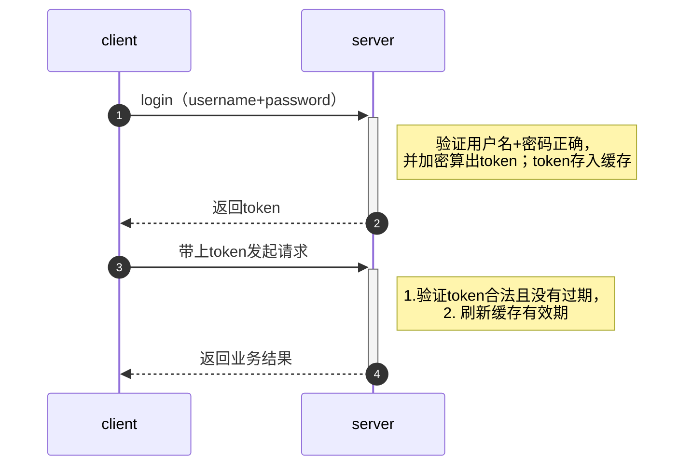

在团队中使用过Django/FastAPI/Spring，开发过或大或小的项目，并且也使用python整合了一套用于生产环境的框架。这些项目大部分都是前后端分离的，是一个提供RESTful API的web server。在go的世界里，开发web server，有很多选择，比如beego/iris/gin等，那么哪一个是一个合适的选择呢？直到我看到这片文章[Golang框架选型比较: goframe, beego, iris和gin ](https://goframe.org/pages/viewpage.action?pageId=3673375) ，尤其这句话吸引了我：**团队踩了一年多的坑，才发现团队确实需要一个统一的技术框架而不是一堆不成体系的轮子**；这句话完全就是团队现在的状态，毫不犹豫的，进入GoFrame~

<!-- more -->


# 一个成熟的项目应该具备哪些特点

一个成熟完整的项目需要事先有标准，有架构，有设计，虽然很多公司在起步的时候没有财力和资源建设独立的基础架构或平台架构部门，甚至运维团队都没有，但是这不妨碍我们心中有一个蓝图，知道努力的方向。

参考：[朱晔的互联网架构实践心得S2E7:漫谈平台架构的工作)](https://www.cnblogs.com/lovecindywang/p/10941007.html)

### 规范

1. 代码仓库管理规范

   1. 有哪几个常驻分支，哪几个临时分支？
   2. 分支命名规范？
   3. 提交代码描述规范？
   4. 分支迁出和合并的时机？
   5. 哪些分支普通开发没有权限直接提交？
   6. 测试用什么分支，上线又用什么分支？
   7. 多版本并行开发如何提测？
   8. Hotfix如何处理分支？

   - 我们的做法：常驻分支master，临时分支有几类：
     - 项目分支：某些项目需要一些特别的功能特性，专门为某些项目做的，可能后期需要继续维护。项目分支的管理只有owner有权限。
     - 开发分支：正在进行的版本开发，可以有多个，比如21.09.1；本次版本开发完成，合入master，删除开发分支，创建下一个版本的开发分支。开发分支只有owner有权限管理
     - 研发分支：我们使用gitlab的merge request功能，每个研发同学提交代码需要先提交merge request，经过审核，才能合入开发分支。合入之后，该研发分支自动删除。研发分支命名规范是：{名}.{姓}_{分支简单描述}，比如：san.zhang_feature-local-image,表示张三同学提交的一个支持local-image功能的分支。
     - 每次commit，需要带上任务id，我们使用[TAPD](https://www.tapd.cn/)做任务管理
     - 测试和上线使用release 包
     - hotfix时，往往是开发分支已经合入master了，所以我们每次在开发版本合入之前，需要打tag。此时，需要hotfix了，从tag再创建新的分支，然后提交代码，验证，打tag，删除分支。
   - 代码仓库的管理关系到研发过程的管理。

2. 编码规范。每种语言的规范基本都有自动化工具，比如go的gofmt插件，python的PEP8等。其次是一些开发规范，可以参考阿里Java开发手册

3. 数据库设计规范。

4. 项目结构规范。这个可以参考GoFrame的目录结构做一些适应性的更改

5. 项目管理流程。也就是前边说到的研发过程管理，包含从需求定义到项目结束的全部环节。复杂大型的项目，比如引入Scrum/kanban等规范的开发流程，简单的项目可以简化规范流程中的一些环节。

   1. 迭代周期，迭代周期中的大环节大概发生的时间点
   2. 开哪些会，开会时间点是？（日站会、周例会、启动会、回顾会、复盘会、排期会、PRD预评审会、PRD评审会、测试用例评审会、上线方案讨论会）
   3. 项目生命周期中每一个角色产出哪些文档？
   4. 任务在哪里管理，每一个角色怎么去维护任务状态的流转？不可能任务的每一个状态的流转都由PMO来做

   以上问题可能会关系到一些工具平台的选型，比如：

   - 源代码仓库：比如可以选择Gitlab
   - 内部类库仓库：比如Java的Maven仓库，可以自己搭建Nexus仓库；docker的仓库；python的仓库等
   - 项目管理平台：可以选择SaaS产品（比如Tower、Teambition），比较有名的是atlassian三件套的Jira； tapd等
   - 知识管理平台：可以选择SaaS或开源Wiki产品，比较有名的是atlassian三件套的Confluence
   - Bug管理平台：比如可以选择禅道或直接复用Jira
   - 代码质量分析：比如可以搭建SonarQube平台

### 基础框架

go使用GoFrame；python使用FastAPI。大致包含以下模块：

1. Web MVC，代码分层。此处完全可以参看GoFrame，API、controller、service、dao以及各层之间流转数据定义的xxxReq/xxxRes和xxxxInput/xxxxOutput
2. 数据访问 orm。比如GoFrame的gdb。
3. 缓存。比如GoFrame的gcache。
4. 数据库版本管理.比如alembic。
5. Web API。通常结合swaager来实现，并且提供API文档。提供统一的RESTful服务端API的标准，比如规范化API版本、响应结构体自动包装（自适应）、错误包装、HATEOAS超媒体资源导航整合、数据加解密实现、Collection资源的规范化、自动的mock接口的实现等。
6. API自动在线文档swaagerUI、redoc。
7. 数据校验。比如GoFrame的gvalid，通常与web API组合使用。
8. 配置。比如GoFrame的gcfg。
9. 日志。比如GoFrame的glog。
10. 命令参数/环境变量。比如GoFrame的gcmd。
11. 打包编译。比如GoFrame的gf工具。
12. 错误以及错误码。比如GoFrame的gerror和gcode.
13. 链路跟踪。比如GoFrame的链路跟踪。
14. I18N。比如GoFrame的i18n
15. 单元测试。
16. 常用工具
    1. http client
    2. 锁。包括互斥锁、分布式锁等
    3. 加解密。md5/ses/des/sha1等
    4. 随机数

可以看到GoFrame除了数据库版本管理其他的模块全部都有。

### 中间件

中间件是指独立部署的不具有业务逻辑耦合 的通用服务，存储服务在广义上归到中间件也不是不可以，这里大概列了几个典型：

- MQ代理（Broker，不是Proxy），比如RabbitMQ、RocketMQ、Kafka
- API网关，有很多开源的网关实现，比如Kong（https://github.com/Kong/kong ）、Spring Cloud Gateway，一般网关的主要功能是调用路由、协议转换、调用编排，然后也会以插件和过滤器形式提供很多安全、弹性方面的扩展功能
- DB代理，比如类似https://github.com/flike/kingshard 和https://github.com/Qihoo360/Atlas 的MySQL Proxy，实现数据库的读写分离、分表分库、故障转移、弹性处理、监控、SQL优化等功能
- ES集群，也可以理解为中间件，毕竟ES其实做的就是基于Lucene的分布式集群管理工作
- nginx

这些中间件虽然很多时候做的是Proxy背后的其它服务，但是节点本身很可能是有状态的，也需要考虑中间件本身的高可用性问题。

### 运维

1. CI/CD平台：一般而言需要自己结合公司的工作流程做一套CI/CD平台（底层可以基于Jenkins（或直接SSH+脚本）封装）
2. 监控：一般会基于Prometheus/Zabbix+Grafana等开源项目来打造运维的基础监控.当然如果是产品需要直接集成到产品里
3. 容器编排：比如K8S平台，一般可能会基于k8s的API做一套自己的k8s管控平台或选用类似Rancher这种更好用更高层的服务，完全基于命令行的k8s运维不是很高效易用，比如 [秒云-云原生智能运维中台 (miaoyun.net.cn)](https://miaoyun.net.cn/)

### 总结

项目总是逐渐在完善、增长的，无论是为了项目的健康还是我们这些码农们的健康，都需要不断的优化，不断的前进~

也可以看到GoFrame作为研发的基础框架，是比较完备的。选他，没错~


# 准备工作

## go语言安装

window版本的安装，自行下载exe进行安装，然后设置环境变量即可。以下以linux安装为主。本次安装版本使用：`go1.16.13`

### apt-get安装

`apt-get install golang`

Debian9 安装的golang版本默认为`golang-1.7`

### 手动安装

1. 到官网`https://golang.google.cn/dl/`下载安装包`wget https://golang.google.cn/dl/go1.16.13.linux-amd64.tar.gz`

2. 创建目录`mkdir -p /usr/local/lib`

3. 解压：`tar -xzf go1.16.13.linux-amd64.tar.gz -C /usr/local/lib`

4. 设置环境变量 编辑 `~/.profile`, 增加以下内容

   ```shell
   # golang
   GOPATH=/root/go-workspace/
   GOROOT=/usr/local/lib/go
   export GO111MODULE=on
   export GOPROXY=https://goproxy.io
   export PATH=$GOPATH/bin:$GOROOT/bin:$PATH
   ```

5. 刷新环境变量。 `source ~/.profile`

6. 安装完成，测试。`go version`

## 为什么选择GoFrame

[Golang框架选型比较: goframe, beego, iris和gin - GoFrame社区投稿 - GoFrame官网 - 类似PHP-Laravel, Java-SpringBoot的Go企业级开发框架](https://goframe.org/pages/viewpage.action?pageId=3673375)

总结：

1. 团队需要一个统一的技术框架，而不是东拼西凑的一堆单仓库包。
2. 我们只需要维护一个框架的版本，而不是维护数十个单仓库包的版本。
3. 框架的组件必须模块化、低耦合设计，保证内部组件也可以独立引用。
4. 核心组件严格禁止单仓库包设计，并且必须由框架统一维护。

走过这么多弯路之后，我们决心建立一套成体系的`Golang`开发框架。除了要求团队能够快速学习，维护成本低，并且我们最主要的诉求，是核心组件不能是半成品，框架必须是上过大规模生产验证的，稳定和成熟的。随着我们重新对行业中流行的技术框架做了技术评估，包括上面说的那些框架。原本的初衷是想将内部的各个轮子统一做一个成体系的框架，在开源项目中找一些有价值的参考。

后来找到了`goframe`，仔细评估和学习了框架设计，发现框架设计思想和我们的经验总结如出一辙！

这里不得不提一件尴尬的事情。其实最开始转`Golang`之前（2019年中旬）也做过一些调研，那时`goframe`版本还不高，并且我们负责评估的团队成员有一种先入为主的思想，看到模块和文档这么多，感觉应该挺复杂，性能应该不高，于是没怎么看就PASS。后来选择一些看起来简单的开源轮子自己做了些二次封装。

这次经过一段时间的仔细调研和源码学习，得出一个结论，`goframe`框架的框架架构、模块化和工程化设计思想非常棒，执行效率很高，模块不仅丰富，而且质量之高，令人惊叹至极！相比较我们之前写的那些半成品轮子，简直就是小巫见大巫。**团队踩了一年多的坑，才发现团队确实需要一个统一的技术框架而不是一堆不成体系的轮子，其实人家早已给了一条明光大道，并且一直在前面默默努力。**

经过团队内部的调研和讨论，我们决定使用`goframe`逐步重构我们的业务项目。由于`goframe`是模块化设计的，因此我们也可以对一些模块做必要的替换。重构过程比较顺利，基础技术框架的重构并不会对业务逻辑造成什么影响，反而通过`goframe`的工程化思想和很棒的开发工具链，在统一技术框架后，极大地提高了项目的开发和维护效率，使得团队可以专心于业务开发，部门也陆续有了更多的产出。目前我们已经有大部门业务项目转向了`goframe`，平台每日流量千万级别。 

## Go Frame 目录结构

`GoFrame`业务项目基本目录结构如下：

```shell
/
├── api
├── internal
│   ├── cmd
│   ├── consts
│   ├── controller
│   ├── model
│   │   └── entity
│   └── service
│       └── internal
│           ├── dao
│           └── do
├── manifest
├── resource
├── utility
├── go.mod
└── main.go 
```

工程目录采用了通用化的设计，实际项目中可以根据项目需要适当增减模板给定的目录。例如，没有`i18n`及`template`需求的场景，直接删除对应目录即可。

| 目录/文件名称   | 说明     | 描述                                                         |
| :-------------- | :------- | :----------------------------------------------------------- |
| `api`           | 接口定义 | 对外提供服务的输入/输出数据结构定义。考虑到版本管理需要，往往以`apiv1/apiv2...`存在。 |
| `internal`      | 内部逻辑 | 业务逻辑存放目录。通过`Golang internal`特性对外部隐藏可见性（导入路径包含`internal`关键字的包，只允许`internal`的父级目录及父级目录的子包导入，其它包无法导入）。 |
| ` - cmd`        | 入口指令 | 命令行管理目录。可以管理维护多个命令行。                     |
| ` - consts`     | 常量定义 | 项目所有常量定义。                                           |
| ` - controller` | 接口处理 | 接收/解析用户输入参数的入口/接口层。                         |
| ` - model`      | 结构模型 | 数据结构管理模块，管理数据实体对象，以及输入与输出数据结构定义。 |
| `  - entity`    | 数据模型 | 数据模型是模型与数据集合的一对一关系，由工具维护，用户不能修改。 |
| ` - service`    | 逻辑封装 | 业务逻辑封装管理，特定的业务逻辑实现和封装。                 |
| `  - dao`       | 数据访问 | 数据访问对象，这是一层抽象对象，用于和底层数据库交互，仅包含最基础的 `CURD` 方法 |
| `  - do`        | 领域对象 | 用于`dao`数据操作中业务模型与实例模型转换，由工具维护，用户不能修改。 |
| `manifest`      | 交付清单 | 包含程序编译、部署、运行、配置的文件。常见内容如下：         |
| ` - config`     | 配置管理 | 配置文件存放目录。                                           |
| ` - docker`     | 镜像文件 | `Docker`镜像相关依赖文件，脚本文件等等。                     |
| ` - deploy`     | 部署文件 | 部署相关的文件。默认提供了`Kubernetes`集群化部署的`Yaml`模板，通过`kustomize`管理。 |
| `resource`      | 静态资源 | 静态资源文件。这些文件往往可以通过 资源打包/镜像编译 的形式注入到发布文件中。 |
| `go.mod`        | 依赖管理 | 使用`Go Module`包管理的依赖描述文件。                        |
| `main.go`       | 入口文件 | 程序入口文件。                                               |

### 业务接口 - `api`

业务接口包含两部分：接口定义（`api`）+接口实现（`controller`）。

`api`包的职责类似于三层架构设计中的`UI`表示层，负责接收并响应客户端的输入与输出，包括对输入参数的过滤、转换、校验，对输出数据结构的维护，并调用 `service` 实现业务逻辑处理。

### 逻辑封装 - `service`

`service`包的职责类似于三层架构设计中的`BLL`业务逻辑层，负责具体业务逻辑的实现以及封装。

### 数据访问 - `dao`

`dao`包的职责类似于三层架构中的`DAL`数据访问层，数据访问层负责所有的数据访问收口。

### 结构模型 - `model`

`model`包的职责类似于三层架构中的`Model`模型定义层。模型定义代码层中仅包含全局公开的数据结构定义，往往不包含方法定义。

这里需要注意的是，这里的`model`不仅负责维护数据实体对象（`entity`）结构定义，也包括所有的输入/输出数据结构定义，被`api/dao/service`共同引用。这样做的好处除了可以统一管理公开的数据结构定义，也可以充分对同一业务领域的数据结构进行复用，减少代码冗余。


三层架构设计与框架代码分层映射关系

## 请求分层流转


### cmd

`cmd`层负责引导程序启动，显著的工作是初始化逻辑、注册路由对象、启动`server`监听、阻塞运行程序直至`server`退出。

### api

上层`server`服务接收客户端请求，转换为`api`中定义的`Req`接收对象、执行请求参数到`Req`对象属性的类型转换、执行`Req`对象中绑定的基础校验并转交`Req`请求对象给`controller`层。

### controller

`controller`层负责接收`Req`请求对象后做一些业务逻辑校验，随后调用一个或多个`service`实现业务逻辑，将执行结构封装为约定的`Res`数据结构对象返回。

### model

`model`层中管理了所有的业务模型，`service`资源的`Input/Output`输入输出数据结构都由`model`层来维护。

### service

`service`层的业务逻辑需要通过调用`dao`来实现数据的操作，调用`dao`时需要传递`do`数据结构对象，用于传递查询条件、输入数据。`dao`执行完毕后通过`Entity`数据模型将数据结果返回给`service`层。

### dao

`dao`层通过框架的`ORM`抽象层组件与底层真实的数据库交互。

  

## Go Frame常见问题解答

### 1. 框架是否支持常见的`MVC`开发模式

**当然！**

作为一款模块化设计的基础开发框架，`GoFrame`不会局限代码设计模式，并且框架提供了非常强大的模板引擎核心组件，可快速用于`MVC`模式中常见的模板渲染开发。相比较`MVC`开发模式，在复杂业务场景中，我们更推荐使大家用三层架构设计模式。

### 2. 如何清晰界定和管理`service`和`controller`的分层职责

`controller`层处理`Req/Res`外部接口请求。负责接收、校验请求参数，并调用**一个或多个** `service`来实现业务逻辑处理，根据返回数据结构组装数据再返回。

`service`层处理`Input/Output`内部方法调用。负责内部**可复用**的业务逻辑封装，封装的方法粒度往往比较细。

因此， **禁止** 从`controller`层直接透传`Req`对象给`service`，也禁止`service`直接返回`Res`数据结构对象，因为`service`服务的主体与`controller`完全不同。当您错误地使用`service`方法处理特定的`Req`对象的时候，该方法也就与对于的外部接口耦合，仅为外部接口服务，难以复用。这种场景下`service`替代了`controller`的作用，造成了本末倒置。

### 3. 如何清晰界定和管理`service`和`dao`的分层职责

这是一个很经典的问题。

**痛点：**

常见的，开发者把数据相关的业务逻辑实现封装到了`dao`代码层中，而`service`代码层只是简单的`dao`调用，这么做的话会使得原本负责维护数据的`dao`层代码越来越繁重，反而业务逻辑`service`层代码显得比较轻。开发者存在困惑，我写的业务逻辑代码到底应该放到`dao`还是`service`中？

业务逻辑其实绝大部分时候都是对数据的`CURD`处理，这样做会使得几乎所有的业务逻辑会逐步沉淀在`dao`层中，业务逻辑的改变其实会频繁对`dao`层的代码产生修改。例如：数据查询在初期的时候可能只是简单的逻辑，目前代码放到`dao`好像也没问题，但是查询需求增加或变化变得复杂之后，那么必定会继续维护修改原有的`dao`代码，同时`service`代码也可能同时做更新。原本仅限于`service`层的业务逻辑代码职责与`dao`层代码职责模糊不清、耦合较重，原本只需要修改`service`代码的需求变成了同时修改`service`+`dao`，使得项目中后期的开发维护成本大大增加。

**建议：**

我们的建议:`dao`层的代码应该尽量保证通用性，并且大部分场景下不需要增加额外方法，只需要使用一些通用的链式操作方法拼凑即可满足。业务逻辑、包括看似只是简单的数据操作的逻辑都应当封装到`service`中，`service`中包含多个业务模块，每个模块独自管理自己的`dao`对象，`service`与`service`之间通过相互调用方法来实现数据通信而不是随意去调用其他`service`模块的`dao`对象。


以上信息总结自gf官网，详情请参看：[框架介绍 - GoFrame (ZH)-v2.0 - GoFrame官网](https://goframe.org/display/gf)

# 开始开发

## 1. gf-cli安装

1. windows二进制安装

   从https://github.com/gogf/gf/releases下载二进制，然后修改名字为`gf.exe`；放置到`%GOROOT%/bin`或者`%GOPATH%/bin`或者使用install命令：

   ```powershell
   $ ./gf_windows_amd64.exe install 
   I found some installable paths for you(from $PATH):
     Id | Writable | Installed | Path
      0 |     true |      true | E:\go-workspace\bin
      1 |     true |     false | D:\programs\go\bin
   please choose one installation destination [default 0]:
   gf binary is successfully installed to: E:\go-workspace\bin
   ```

2. 手动安装

   `git clone https://github.com/gogf/gf && cd gf/cmd/gf && go install`

3. 校验

   `gf -v`

   得到如下输出证明OK：

   ```shell
   GoFrame CLI Tool v2.0.6, https://goframe.org
   GoFrame Version: v2.0.6 in current go.mod
   CLI Installed At: E:\go-workspace\bin\gf.exe
   CLI Built Detail:
     Go Version:  go1.17.7
     GF Version:  v2.0.6
     Git Commit:  2022-03-31 16:57:32 66803fd6641e31c60f0489180668243ea092b87b
     Build Time:  2022-03-31 16:55:38
   ```

## 2. 数据库表设计

在数据库中进行表结构设计，包括字段、长度、主键、描述等。设计完成之后，导出SQL文件保存到resource/doc目录下。

## 3. gf cli自动生成dao/do/entity

1. 配置好配置文件，重点

   ```toml
   # GF-CLI工具配置
   [gfcli]
       # 自定义DAO生成配置(默认是读取database配置)
       [[gfcli.gen.dao]]
           link   = "mysql:root:mysql@tcp(192.168.212.117:3306)/myapp"
           descriptionTag =   true
           noModelComment =   true
   ```

2. 使用gf  cli命令

   `gf gen dao`，成功时可以得到如下类似的输出：

   ```shell
   > gf gen dao
   generated: internal\service/internal/dao\desktop.go
   generated: internal\service/internal/dao\internal\desktop.go
   generated: internal\service/internal/dao\user.go
   generated: internal\service/internal/dao\internal\user.go
   generated: internal\service/internal/do\desktop.go
   generated: internal\service/internal/do\user.go
   generated: internal\model/entity\desktop.go
   generated: internal\model/entity\user.go
   done!
   ```

   可以查看具体文件是否生成。

## 4. 开始代码开发

### 1. main

main 入口程序，启动http server，监听端口

> gf 还支持cmd，可以在启动服务的时候加入命令行支持，具体可以参看gf的命令管理章节。

```go
func main() {
	s := g.Server()
	g.I18n().SetPath("resource/i18n") // i18n目录默认是gres资源目录或者根目录；在研发阶段需要重设一下i18n目录
	s.Group("/", func(group *ghttp.RouterGroup) {
		group.Middleware(
			service.Middleware().I18NMiddleware,
			service.Middleware().ResponseHandler,
		)
		//group.Bind(
		//	controller.User,    // 用户
		//	controller.Desktop, // 桌面
		//)
		// 官方文档建议使用对象注册（如上）的规范路由：path和method写到API的struct中，但是并没有写到一个地方感觉便于管理
		group.Group("/users", func(group *ghttp.RouterGroup) {
			group.GET("/", controller.User.List)
			group.POST("/", controller.User.Create)
			group.GET("/{uuid}", controller.User.Get)
			group.PATCH("/{uuid}", controller.User.Update)
			group.DELETE("/{uuid}", controller.User.Delete)
		})
		group.Group("/desktops", func(group *ghttp.RouterGroup) {
			group.GET("/", controller.Desktop.List)
			group.POST("/", controller.Desktop.Create)
			group.GET("/{uuid}", controller.Desktop.Get)
			group.PATCH("/{uuid}", controller.Desktop.Update)
			group.DELETE("/{uuid}", controller.Desktop.Delete)
		})
	})
	// 自定义丰富文档
	enhanceOpenAPIDoc(s)
	// 启动Http Server
	s.Run()
}
```

`g.Server()`方法获得一个默认的`Server`对象，该方法采用`单例模式`设计，也就是说，多次调用该方法，返回的是同一个`Server`对象。通过`Run()`方法执行`Server`的监听运行，在没有任何额外设置的情况下，它默认监听`80`端口。

其他功能，请参看gf文档：[开始使用web服务开发](https://goframe.org/pages/viewpage.action?pageId=1114155)

- 支持静态文件的`WebServer`
- `Server`支持多端口监听
- `Server`支持同一进程多实例运行
- `Server`支持多域名绑定
- 支持https
- 支持server启动加载配置文件的配置项

### 2. 路由

gf注册路由有多种方式：函数注册/对象注册/restful对象注册/分组路由注册/层级注册（分组嵌套）/map形式的批量注册。

gf使用对象注册+分组路由，结合OpenAPIv3（swagger）作为规范化路由注册方案。

规范化注册可以规范化接口方法参数，统一接口返回数据格式，自动化的参数校验等。但是有一点不方便维护以及不便于检查路由冲突。所以**本项目基于规范化注册并进行一点修改**：

1. 通过配置文件，设置`SwaggerUI`页面

       ```toml
       # HTTP Server.
       [server]
           openapiPath    = "/api.json"
           swaggerPath    = "/swagger"
       ```

 2. 路由绑定

    使用**分组路由**的方式而不是规范化路由的对象注册方式，在main入口程序绑定路由。

    如果是规范化路由注册的话，只需要简单设置即可：

    ```go
    group.Bind(
    	controller.User,    // 用户
    	controller.Desktop, // 桌面
    )
    另外，具体的path和url在结构体中定义
    type UserUpdateReq struct {
    	g.Meta      `path:"/user" method:"put" summary:"更新用户" tags:"用户"`
    	......
    }
    ```

    但是按照规范化路由注册的话，感觉url的设计没有统一放在一个地方来的舒服以及便于管理。所以此处，直接使用了分组路由：

    ```go
    s.Group("/", func(group *ghttp.RouterGroup) {
    		group.Middleware(
    			service.Middleware().I18NMiddleware,
    			service.Middleware().ResponseHandler,
    		)
    		// 官方文档建议使用对象注册（如上）的规范路由：path和method写到API的struct中，但是并没有写到一个地方感觉便于管理
    		group.Group("/users", func(group *ghttp.RouterGroup) {
    			group.GET("/", controller.User.List)
    			group.POST("/", controller.User.Create)
    			group.GET("/{uuid}", controller.User.Get)
    			group.PATCH("/{uuid}", controller.User.Update)
    			group.DELETE("/{uuid}", controller.User.Delete)
    		})
    	})
    ```

 3. 请求/返回结构体的定义: 包含了输入参数的定义，也包含了接口的定义，特别是路由地址、请求方法、接口描述等信息。**本项目把path和method提到入口路由注册的地方，所以结构体去除了相应的配置**。为保证命名规范化，输入数据结构以`XxxReq`方式命名，输出数据结构以`XxxRes`方式命名。即便输入或者输出参数为空，也需要定义相应的数据结构，这样的目的一个是便于后续扩展，另一个是便于接口信息的管理。

    ```go
    // myapp/api/user.go
    type UserUpdateReq struct {
    	g.Meta      `summary:"更新用户" tags:"用户"`
    	LoginName   string `json:"loginName" p:"loginName" v:"passport"  dc:"登录名"`
    	DisplayName string `json:"displayName" p:"displayName" dc:"姓名"`
    	Enabled     string `json:"enabled" p:"enabled" v:"in:enabled,disabled"  d:"enabled" dc:"用户的启用状态"`
    	Email       string `json:"email" p:"email" d:"" v:"email"  dc:"邮箱"`
    	Phone       string `json:"phone" p:"phone" d:"" v:"phone" dc:"电话"`
    	Desc        string `json:"desc" p:"desc" d:"" v:"max-length:255"  dc:"描述信息"`
    }
    
    type UserGetRes struct {
    	Uuid        string      `json:"uuid"        dc:"uuid"`
    	LoginName   string      `json:"loginName"   dc:"登录名"`
    	DisplayName string      `json:"displayName" dc:"姓名"`
    	Email       string      `json:"email"       dc:"邮箱"`
    	Phone       string      `json:"phone"       dc:"电话"`
    	Enabled     string      `json:"enabled"     dc:"用户的启用状态，enabled表示启用，disabled表示禁用"`
    	Desc        string      `json:"desc"        dc:"描述信息"`
    	CreatedAt   *gtime.Time `json:"createdAt"   dc:"创建时间"`
    	UpdatedAt   *gtime.Time `json:"updatedAt"   dc:"最后修改时间"`
    }
    ```

    - 这里的UserUpdateReq结构体，定义了入参的字段有那些，以及每个字段的格式，比如是否必须、长度、正则等。此处必须要提的是gf的validate功能很是舒爽，提供了40多个内置的校验规则，包含email、phone、passport等常见的正则。

      这里的校验是通过p标签来实现的：`p`标签是可选的，默认情况下会通过 **忽略特殊字符（`-/_/空格`）+不区分大小写** 的规则进行属性名称匹配转换。所以API的请求参数是可以忽略大小写以及特殊字符的。

      UserUpdateReq我加上了json标签，目的是想要在swaggerUI上显示的demo结构与response结构一致。

    - 使用g.Meta定义接口，包含url path;url method,以及关联swagger

4. 路由方法定义

   ```go
   func Handler(ctx context.Context, req *Request) (res *Response, err error)
   ```

   路由方法使用固定的格式，如上。`req *Request`就是上一步骤定义的请求结构体，gf通过这个参数把路由与路由方法关联起来。

5. 返回结构体定义

   正如请求结构体定义章节所说，返回结构体以`XxxRes`方式命名。即便输出参数为空，也需要定义相应的数据结构。

6. 数据返回

   经过返回结构体定义规范，我们得到了API请求的返回数据，此时我们还可以继续对返回数据进行整理，得到统一的返回值数据结构。此处使用后置middleware来处理。

   ```go
   // myapp/internal/service/middleware.go
   func (s *sMiddleware) ResponseHandler(r *ghttp.Request) {
   	r.Middleware.Next()
   
   	// 如果已经有返回内容，那么该中间件什么也不做
   	if r.Response.BufferLength() > 0 {
   		return
   	}
   
   	var (
   		err  error
   		res  interface{}
   		code gcode.Code = gcode.CodeOK
   	)
   	res, err = r.GetHandlerResponse()
   	if err != nil {
   
   		code = gerror.Code(err)
   		if code == errorCode.CodeNil {
   			code = errorCode.CodeInternalError
   		}
   		if detail, ok := code.Detail().(errorCode.MyCodeDetail); ok {
   			r.Response.WriteStatus(detail.HttpCode)
   			r.Response.ClearBuffer() // gf 会自动往response追加http.StatusText。此处不需要，所以删除掉。
   		}
   		g.Log().Errorf(r.GetCtx(), "%+v", err)
   		response.JsonExit(r, code.Code(), err.Error())
   	} else {
   		response.JsonExit(r, code.Code(), "", res)
   	}
   }
   
   // myapp/utility/response/response.go
   
   // Json 返回标准JSON数据。
   func Json(r *ghttp.Request, code int, message string, data ...interface{}) {
   	var responseData interface{}
   	f len(data) > 0 {
   		responseData = data[0]
   		if reflect.ValueOf(responseData).IsNil() { // responseData是interface类型，判空需要使用反射；
   			responseData = g.Map{} // response 为nil时，返回{}
   		}
   	} else {
   		responseData = g.Map{}
   	}
   	r.Response.WriteJson(JsonRes{
   		Code:    code,
   		Message: message,
   		Data:    responseData,
   	})
   	r.Response.Header().Set("Content-Type", "application/json;charset=utf-8") // 重置response head增加charset=utf-8
   }
   
   // JsonExit 返回标准JSON数据并退出当前HTTP执行函数。
   func JsonExit(r *ghttp.Request, code int, message string, data ...interface{}) {
   	Json(r, code, message, data...)
   	r.Exit()
   }
   ```

   我们在这里统一设置API的response的数据结构：

   ```go
   JsonRes{
   		Code:    code,
   		Message: message,
   		Data:    responseData,
   	}
   ```

   并且设置Content-Type、Response.WriteStatus。

   特别注意：Response.WriteStatus的设置，gf会自动再response添加http.StatusText，所以要清理一下： `r.Response.ClearBuffer()`。

### 3. middleware

gf支持使用middleware，如上一章提到的ResponseHandler middleware,还支持hook。


中间件（`Middleware`）与事件回调（`HOOK`）是`GF`框架的两大流程控制特性，两者都可用于控制请求流程，并且也都支持绑定特定的路由规则。但两者区别也是非常明显的。

1. 首先，中间件侧重于应用级的流程控制，而事件回调侧重于服务级流程控制；也就是说中间件的作用域仅限于应用，而事件回调的“权限”更强大，属于`Server`级别，并可处理静态文件的请求回调。
2. 其次，中间件设计采用了“洋葱”设计模型；而事件回调采用的是特定事件的钩子触发设计。
3. 最后，中间件相对来说灵活性更高，也是比较推荐的流程控制方式；而事件回调比较简单，但灵活性较差。

### 4. openAPIDoc(swagger)

除了我们的业务路由之外，`Server`自动帮我们注册了两个路由：`/api.json`和`/swagger/*`。前者是自动生成的基于标准的`OpenAPIv3`协议的接口文档，后者是自动生成`SwaggerUI`页面，方便开发者查看和调试。这两个功能默认是关闭的，开发者可以通过前面配置文件示例中的`openapiPath`和`swaggerPath`两个配置项开启。

-  `> v2.0.0-rc3`版本swaggerUI的实现为redoc（redoc没有try it功能）
-  `<= v2.0.0-rc3`版本swaggerUI的实现为swaggerUI

为了使用高版本的gf，并且使用swaggerUI，可以使用gf的静态文件方式，实现自定义的swaggerUI。

1. 开启静态文件服务支持

   ```toml
   [server]
       serverRoot     = "/resource/public"  # 开启静态文件目录，支持swaggerUI
       openapiPath    = "/api.json"
       swaggerPath    = "/redoc" # /swagger使用本地静态文件实现，所以此处不能设置路径为/swagger
   ```

2. 添加swaggerUI的文件。可以从[github](https://github.com/swagger-api/swagger-ui/releases/tag/v4.11.0)上下载；也可以使用[CDN](https://www.bootcdn.cn/swagger-ui/)

   - 下载文件之后，类似于这样的结构

   ```shell
   ├───public
   │   └───swagger
   │           favicon-16x16.png
   │           favicon-32x32.png
   │           index.css
   │           index.html
   │           oauth2-redirect.html
   │           swagger-initializer.js
   │           swagger-ui-bundle.js
   │           swagger-ui-bundle.js.map
   │           swagger-ui-es-bundle-core.js
   │           swagger-ui-es-bundle-core.js.map
   │           swagger-ui-es-bundle.js
   │           swagger-ui-es-bundle.js.map
   │           swagger-ui-standalone-preset.js
   │           swagger-ui-standalone-preset.js.map
   │           swagger-ui.css
   │           swagger-ui.css.map
   │           swagger-ui.js
   │           swagger-ui.js.map
   ```

   修改swagger-initializer.js，把json文件替换为自己的json文件，即： `/api.json`

   - 如果使用CDN的话，只需要index.html就够了

   ```html
   <!-- HTML for static distribution bundle build -->
   <!DOCTYPE html>
   <html lang="en">
     <head>
       <meta charset="UTF-8">
       <title>Swagger UI</title>
       <link rel="stylesheet" type="text/css" href="https://cdn.bootcdn.net/ajax/libs/swagger-ui/4.10.3/swagger-ui.css" />
       <link rel="icon" type="image/png" href="https://cdn.jsdelivr.net/npm/swagger-ui@4.10.3/dist/favicon-32x32.png" sizes="32x32" />
       <link rel="icon" type="image/png" href="https://cdn.jsdelivr.net/npm/swagger-ui@4.10.3/dist/favicon-16x16.png" sizes="16x16" />
     </head>
   
     <body>
       <div id="swagger-ui"></div>
       <script src="https://cdn.bootcdn.net/ajax/libs/swagger-ui/4.10.3/swagger-ui-bundle.js"></script>
       <script src="https://cdn.bootcdn.net/ajax/libs/swagger-ui/4.10.3/swagger-ui-standalone-preset.js"></script>
       <script>
         window.onload = function() {
           //<editor-fold desc="Changeable Configuration Block">
   
           // the following lines will be replaced by docker/configurator, when it runs in a docker-container
           window.ui = SwaggerUIBundle({
             // url: "https://petstore.swagger.io/v2/swagger.json",
             url: "/api.json",
             dom_id: '#swagger-ui',
             deepLinking: true,
             presets: [
               SwaggerUIBundle.presets.apis,
               SwaggerUIStandalonePreset
             ],
             plugins: [
               SwaggerUIBundle.plugins.DownloadUrl
             ],
             layout: "StandaloneLayout"
           });
   
           //</editor-fold>
         };
   
       </script>
   
     </body>
   </html>
   ```

3. 访问地址：`http://127.0.0.1:8199/swagger`即可得到swaggerUI，访问地址：`http://127.0.0.1:8199/redoc`即可得到redoc

### 5. controller 

界定和管理`service`和`controller`的分层职责:

- `controller`层处理`Req/Res`外部接口请求。负责接收、校验请求参数，并调用**一个或多个** `service`来实现业务逻辑处理，根据返回数据结构组装数据再返回。
- `service`层处理`Input/Output`内部方法调用。负责内部**可复用**的业务逻辑封装，封装的方法粒度往往比较细。

### 6. service

`service`层处理`Input/Output`内部方法调用。负责内部**可复用**的业务逻辑封装，封装的方法粒度往往比较细。

service会调用底层dao进行orm操作。

1. OmitEmpty()

   空值会影响于写入/更新操作方法，如`Insert`, `Replace`, `Update`, `Save`操作。当 `map`/`struct` 中存在空值如 `nil`,`""`,`0` 时，默认情况下，`gdb`将会将其当做正常的输入参数，因此这些参数也会被更新到数据表。如以下操作（以`map`为例，`struct`同理）：

   ```go
   // UPDATE `user` SET `name`='john',update_time=null WHERE `id`=1
   db.Table("user").Data(g.Map{
       "name"        : "john",
       "update_time" : nil,
   }).Where("id", 1).Update()
   ```

   针对空值情况，我们可以通过`OmitEmpty`方法来过滤掉这些空值。

   ```go
   // UPDATE `user` SET `name`='john' WHERE `id`=1
   db.Table("user").OmitEmpty().Data(g.Map{
       "name"        : "john",
       "update_time" : nil,
   }).Where("id", 1).Update()
   ```

   关于`omitempty`标签与`OmitEmpty`方法：

   1. 针对于`struct`的空值过滤大家会想到`omitempty`的标签。该标签常用于`json`转换的空值过滤，也在某一些第三方的`ORM`库中用作`struct`到数据表字段的空值过滤，即当属性为空值时不做转换。
   2. `omitempty`标签与`OmitEmpty`方法所达到的效果是一样的。在`ORM`操作中，我们不建议对`struct`使用`omitempty`的标签来控制字段的空值过滤，而建议使用`OmitEmpty`方法来做控制。因为该标签一旦加上之后便绑定到了`struct`上，没有办法做灵活控制；而通过`OmitEmpty`方法使得开发者可以选择性地、根据业务场景对`struct`做空值过滤，操作更加灵活。

### 7. inputModel和outputModel

inputModel和outputModel是controller和service层交互数据的数据规范格式。`Input/Output`输入输出数据结构都由`model`层来维护。

### 8. dao/do/entity自动生成

使用`gf gen dao`生成dao/do/entity（使用gf版本要大于v2）.生成的逻辑是基于配置文件配置的sql连接配置：

```toml
[gfcli]
    # 自定义DAO生成配置(默认是读取database配置)
    [[gfcli.gen.dao]]
        link   = "mysql:root:mysql@tcp(192.168.212.117:3306)/myapp"  # mysql连接配置
        descriptionTag =   true  # 用于指定是否为数据模型结构体属性增加desription的标签，内容为对应的数据表字段注释。
        noModelComment =   true  # 用于指定是否关闭数据模型结构体属性的注释自动生成，内容为数据表对应字段的注释。
```

以上配置项参数详见11节：配置管理。 

使用`gf gen dao`会使用gf工具连接mysql，然后根据配置项，自动生成dao/do/entity文件。以下`3`个目录的文件由`dao`命令生成：

| 路径                             | 说明         | 详细介绍                                                     |
| :------------------------------- | :----------- | :----------------------------------------------------------- |
| `/internal/model/entity`         | 数据模型     | 数据模型由工具维护，用户不能修改。工具每次生成代码文件将会覆盖该目录。 |
| `/internal/service/internal/do`  | 数据转换模型 | 数据转换模型用于业务模型到数据模型的转换，由工具维护，用户不能修改。工具每次生成代码文件将会覆盖该目录。 |
| `/internal/service/internal/dao` | 数据操作对象 | 通过对象方式访问底层数据源，底层基于ORM组件实现。往往需要结合`entity`和`do`通用使用。该目录下的文件开发者可扩展修改，但是往往没这种必要。 |

`model`中的模型分为两类：**数据模型**和**业务模型**。

**数据模型：**通过`CLI`工具自动生成 `model/entity` 目录文件，数据库的数据表都会生成到该目录下，这个目录下的文件对应的模型为数据模型。数据模型即与数据表一一对应的数据结构，开发者往往不需要去修改并且也不应该去修改，数据模型只有在数据表结构变更时通过`CLI`工具自动更新。数据模型由`CLI`工具生成及统一维护。

**业务模型：**业务模型即是与业务相关的数据结构，按需定义，例如`service`的输入输出数据结构定义、内部的一些数据结构定义等。业务模型由开发者根据业务需要自行定义维护，定义到`model`目录下。

`dao`中的文件按照数据表名称进行命名，一个数据表一个文件及其一个对应的`DAO`对象。操作数据表即是通过`DAO`对象以及相关操作方法实现。`dao`操作采用规范化设计，必须传递`ctx`参数，并在生成的代码中必须通过`Ctx`或者`Transaction`方法创建对象来链式操作数据表。

同时，`dao`采用了工程化规范设计。可以看到，`dao/do`是`service`层内部模块，也就是说，只有`service`层才能访问`dao`数据操作对象并与底层数据库交互。这样通过工具落地规范的方式避免了项目中随处调用`dao`操作数据库的情况，规范了请求调用链。

遗憾的是，gf没有设计类似于almbic这样的数据库版本控制工具，这一块需要我们自己搞定。

### 9. errCode

errCode往往与I18N关联，一个code对应一个文字描述的解释，而文字描述往往期望能够i18n显示。

code的设计关系到一个问题的争议：异常处理的HTTP响应状态码是否依然返回200？

- https://stackoverflow.com/questions/27921537/returning-http-200-ok-with-error-within-response-body

1. 如果我们明确API是REST的，而且API对外使用，应当使用合适的状态码来反映错误（建议控制在20个以内常用的），并且在文档中进行说明，而且出错后需要在响应体补充细化的error信息（包含code和message）

   - 200 这个最容易理解，就是正确的请求返回正确的结果，如果不想细分正确的请求结果都可以直接返回200。
   - 201 表示资源被正确的创建。比如说，我们 POST 用户名、密码正确创建了一个用户就可以返回 201。
   - 202 请求是正确的，但是结果正在处理中，没法返回对应的结果。比如说，我们请求一个需要大量计算的结果，但是并没有计算结束时，可以返回这个，这时候客户端可以通过轮询等机制继续请求。
   - 204 请求正确，但是没有需要返回的内容。比如说，我们请求删除某个用户，删除成功可以返回 204
   - 400 请求出现错误，比如请求头不对等，所有不想明确区分的客户端请求出错都可以返回 400。
   - 401 没有提供认证信息。比如说，请求的时候没有带上 Token 等。
   - 403 请求的资源不允许访问。比如说，你使用普通用户的 Token 去请求管理员才能访问的资源。
   - 404 请求的内容不存在。
   - 405 请求的方法不允许使用。比如说，服务器只实现了 PATCH 了局部更新资源，并没有实现 PUT 来替换资源，而我们使用了 PUT，这时候服务器可以返回 405 来告知并没有实现对 PUT 的相关处理。
   - 409 请求冲突。比如说，服务器要求不同用户不能重名，服务器已经有了一个名叫小伟的用户，这时候我们又想创建一个名叫小伟的用户，服务器可以返回 409，告诉我们冲突了，也可以在 body 中明确告知是什么冲突了。
   - 500 服务器错误。没法明确定义的服务器错误都可以返回这个。
   - 502 网关错误。比如说，我们向服务器 A 请求下载葫芦娃，但是 A 其实只是一个代理服务器，他得向 B 请求葫芦娃，但是不知道为啥 B 不理他或者给他错误，这时候哦可以 A 返回 502 用来表示 B 这家伙傲娇了。

   基本上以上12个状态码最常用，这些也基本满足需求了。

2. 如果REST API对内使用，那么在客户端和服务端商量好统一标准的情况下可以对响应码类型进行收敛到几个，实现起来也方便

   - 200 只要服务接收请求并且如预期的处理了，就可以直接返回200。表示请求被服务接收，参数合法，至于业务是否成功，可以根据response的业务码来确定。这里一般要求response的结构要统一被封装好。比如

     ```go
     JsonRes{
     		Code:    code,
     		Message: message,
     		Data:    responseData,
     	}
     ```

     这里的code就是业务码。gf也内置有一些。

   - 400 参数不合法，包括参数缺失、参数格式错误等

   - 401 认证失败

   - 500 服务接收请求，但是出现预料之外的错误，比如db离线，执行sql失败。

   以上4个状态码基本就包含了第一点所说的12种 状态码了。

3. 如果API是内部使用的RPC over HTTP形式，甚至可以退化到业务异常也使用200响应返回

本项目希望尽可能的遵守RESTful规范，使用合适的状态码来反映错误，并且返回统一的response来进行错误说明。

如上总结所示，我们先定义了一个自己的Code:

```go
type MyCode struct {
	code    int
	message string // message 设计为i18n的key
	detail  MyCodeDetail
}
type MyCodeDetail struct {
	HttpCode int
}

func (c MyCode) MyDetail() MyCodeDetail {
	return c.detail
}

func (c MyCode) Code() int {
	return c.code
}

func (c MyCode) Message() string {
	return c.message
}

func (c MyCode) Detail() interface{} {
	return c.detail
}

func New(httpCode int, code int, message string) gcode.Code {
	return MyCode{
		code:    code,
		message: message,
		detail: MyCodeDetail{
			HttpCode: httpCode,
		},
	}
}
```

然后声明一些code码：

```go
var (
	// gf框架内置的，参见：github.com\gogf\gf\v2@v2.0.0-rc2\errors\gcode\gcode.go
	CodeNil           = New(200, -1, "")
	CodeNotFound      = New(404, 65, "Not Found")
	CodeInternalError = New(500, 50, "An error occurred internally")

	// 系统起始 10000
	CodeBadRequest = New(400, 10000, `{#badRequestParameter}`)

	//用户20000起始
	UserNotFound        = New(404, 20001, `{#userNotExists}`)
	LoginNameConflicted = New(403, 20002, `{#loginNameConflicted}`)

	// 桌面30000起始
	DesktopNotFound = New(404, 30001, `{#desktopNotExists}`)
)
```

最后封装一个方法，把code与i18n关联起来：

```go
func NewMyErr(ctx context.Context, code gcode.Code, params ...string) error {
	// 由于g.I18n().Tf(ctx context.Context, format string, values ...interface{}) values是一个[]interface{},所以需要转一下格式
	v := make([]interface{}, len(params))
	for i, p := range params {
		v[i] = p
	}
	tfStr := g.I18n().Tf(ctx, code.Message(), v...)
	return gerror.NewCode(code, tfStr)
}
```

使用的时候，`errorCode.NewMyErr(ctx, errorCode.DesktopNotFound, req.Uuid)`传参即可。同时在i18n要做好相应的中英文翻译

```toml
// zh-CN.toml
desktopNotExists = "云桌面 uuid=%s 不存在。"
```

```toml
// en.toml
desktopNotExists = "Desktop uuid=%s not exists。"
```

### 10. I18N

i18n是一个 成熟的商业软件具备的特性之一。gf支持i18n的设置。

i18n文件推荐使用toml文件格式。

默认情况下，i18n从main.go入口文件同级目录加载i18n/文件夹下的文件内容，根据文件名生成相应的map表，需要使用翻译时，从map表获取对应的value作为翻译文字。也可以使用`g.I18n().SetPath("resource/i18n")`修改i18n的加载路径。当然在发布时，使用`gres`资源管理的话，也可以的。

TODO: 官方文档说，正常开发时，只需要把i18n放到resource/i18n目录下就会正常加载，但是实验发现并没有，只能手动设置

### 11. 配置管理

支持yaml/toml/json/xml/ini文件格式，建议使用toml.

推荐使用单例模式获取配置管理对象。我们可以方便地通过`g.Cfg()`获取默认的全局配置管理对象。

推荐使用配置文件来管理配置项，配置文件推荐位置为：manifest/config/config.toml

配置项主要有以下几个部分

#### server 

详细可以参看：[gf server config](https://pkg.go.dev/github.com/gogf/gf/v2/net/ghttp#ServerConfig)

以下为配置示例文件：

```toml
[server]
    # 基本配置
    address             = ":80"                        # 本地监听地址。默认":80"
	httpsAddr           = ":443"                       # TLS/HTTPS配置，同时需要配置证书和密钥。默认关闭
	httpsCertPath       = ""                           # TLS/HTTPS证书文件本地路径，建议使用绝对路径。默认关闭
	httpsKeyPath        = ""                           # TLS/HTTPS密钥文件本地路径，建议使用绝对路径。默认关闭
	readTimeout         = "60s"                        # 请求读取超时时间，一般不需要配置。默认为60秒
	writeTimeout        = "0"                          # 数据返回写入超时时间，一般不需要配置。默认不超时（0）
	idleTimeout         = "60s"                        # 仅当Keep-Alive开启时有效，请求闲置时间。默认为60秒
	maxHeaderBytes      = "10240"                      # 请求Header大小限制（Byte）。默认为10KB
	keepAlive           = true                         # 是否开启Keep-Alive功能。默认true
	serverAgent         = "GoFrame HTTP Server"        # 服务端Agent信息。默认为"GoFrame HTTP Server"

    # 静态服务配置
	indexFiles          = ["index.html","index.htm"]   # 自动首页静态文件检索。默认为["index.html", "index.htm"]
	indexFolder         = false                        # 当访问静态文件目录时，是否展示目录下的文件列表。默认关闭，那么请求将返回403
    serverRoot          = "/var/www"                   # 静态文件服务的目录根路径，配置时自动开启静态文件服务。默认关闭
	searchPaths         = ["/home/www","/var/lib/www"] # 提供静态文件服务时额外的文件搜索路径，当根路径找不到时则按照顺序在搜索目录查找。默认关闭
	fileServerEnabled   = false                        # 静态文件服务总开关。默认false

    # Cookie配置
	cookieMaxAge        = "365d"             # Cookie有效期。默认为365天
	cookiePath          = "/"                # Cookie有效路径。默认为"/"表示全站所有路径下有效
	cookieDomain        = ""                 # Cookie有效域名。默认为当前配置Cookie时的域名

	# Sessions配置
	sessionMaxAge       = "24h"              # Session有效期。默认为24小时
	sessionIdName       = "gfsessionid"      # SessionId的键名名称。默认为gfsessionid
	sessionCookieOutput = true               # Session特性开启时，是否将SessionId返回到Cookie中。默认true
	sessionPath         = "/tmp/gsessions"   # Session存储的文件目录路径。默认为当前系统临时目录下的gsessions目录

    # Logging配置
	logPath             = ""                 # 日志文件存储目录路径，建议使用绝对路径。默认为空，表示关闭
    logStdout           = true               # 日志是否输出到终端。默认为true
    errorStack          = true               # 当Server捕获到异常时是否记录堆栈信息到日志中。默认为true
    errorLogEnabled     = true               # 是否记录异常日志信息到日志中。默认为true
    errorLogPattern     = "error-{Ymd}.log"  # 异常错误日志文件格式。默认为"error-{Ymd}.log"
    accessLogEnabled    = false              # 是否记录访问日志。默认为false
    accessLogPattern    = "access-{Ymd}.log" # 访问日志文件格式。默认为"access-{Ymd}.log"
	
	# 日志扩展配置(参数日志组件配置)
    [server.logger]
      path=                  "/var/log/"   # 日志文件路径。默认为空，表示关闭，仅输出到终端
      file=                  "{Y-m-d}.log" # 日志文件格式。默认为"{Y-m-d}.log"
      prefix=                ""            # 日志内容输出前缀。默认为空
      level=                 "all"         # 日志输出级别
      stdout=                true          # 日志是否同时输出到终端。默认true
      rotateSize=            0             # 按照日志文件大小对文件进行滚动切分。默认为0，表示关闭滚动切分特性
      rotateExpire=          0             # 按照日志文件时间间隔对文件滚动切分。默认为0，表示关闭滚动切分特性
      rotateBackupLimit=     0             # 按照切分的文件数量清理切分文件，当滚动切分特性开启时有效。默认为0，表示不备份，切分则删除
      rotateBackupExpire=    0             # 按照切分的文件有效期清理切分文件，当滚动切分特性开启时有效。默认为0，表示不备份，切分则删除
      rotateBackupCompress=  0             # 滚动切分文件的压缩比（0-9）。默认为0，表示不压缩
      rotateCheckInterval=   "1h"          # 滚动切分的时间检测间隔，一般不需要设置。默认为1小时
    # PProf配置
	pprofEnabled        = false              # 是否开启PProf性能调试特性。默认为false
	pprofPattern        = ""                 # 开启PProf时有效，表示PProf特性的页面访问路径，对当前Server绑定的所有域名有效。

    # 其他配置
	clientMaxBodySize   = 810241024          # 客户端最大Body上传限制大小，影响文件上传大小(Byte)。默认为8*1024*1024=8MB
	formParsingMemory   = 1048576            # 解析表单时的缓冲区大小(Byte)，一般不需要配置。默认为1024*1024=1MB
	nameToUriType       = 0                  # 路由注册中使用对象注册时的路由生成规则。默认为0；可选值为0/1/2/3。
	                                         # 0：（默认）全部转为小写，单词以'-'连接符号连接
                                             # 1: 不处理名称，以原有名称构建成URI.
                                             # 2: 仅转为小写，单词间不使用连接符号.
                                             # 3: 采用驼峰命名方式. 
	routeOverWrite      = false              # 当遇到重复路由注册时是否强制覆盖。默认为false，重复路由存在时将会在启动时报错退出
	dumpRouterMap       = true               # 是否在Server启动时打印所有的路由列表。默认为true
	graceful            = false              # 是否开启平滑重启特性，开启时将会在本地增加10000的本地TCP端口用于进程间通信。默认false             
    gracefulTimeout     = 2                  # 父进程在平滑重启后多少秒退出，默认2秒。若请求耗时大于该值，可能会导致请求中断<br />
```

#### db

```toml
[database]:
  分组名称:
    host="127.0.0.1"  # 地址
    port="3306"       # 端口
    user="root"       # 账号
    pass="mysql"      # 密码
    name="mysql"      # 数据库名称
    type="mysql"      # 数据库类型(mysql/pgsql/mssql/sqlite/oracle)
    link = "mysql:root:mysql@tcp(192.168.212.117:3306)/myapp"  # (可选)自定义数据库链接信息，当该字段被设置值时，以上链接字段(Host,Port,User,Pass,Name)将失效，但是type必须有值;或者也可以将type数据库类型写到link配置项中
    role="master"     # (可选)数据库主从角色(master/slave)，不使用应用层的主从机制请均设置为master
    debug=true        # (可选)开启调试模式
    prefix="gf_"      # (可选)表名前缀
    dryRun=true       # (可选)ORM空跑(只读不写)
    charset="utf8"    # (可选)数据库编码(如: utf8/gbk/gb2312)，一般设置为utf8
    weight=100        # (可选)负载均衡权重，用于负载均衡控制，不使用应用层的负载均衡机制请置空
    timezone="local"  # (可选)时区配置，例如:local
    maxIdle=10        # (可选)连接池最大闲置的连接数
    maxOpen=100       # (可选)连接池最大打开的连接数
    maxLifetime="30s" # (可选)连接对象可重复使用的时间长度
    createdAt="createdAt"  # (可选)自动创建时间字段名称
    updatedAt="updatedAt"  #(可选)自动更新时间字段名称
    deletedAt="deletedAt"  # (可选)软删除时间字段名称
    timeMaintainDisabled=true  # (可选)是否完全关闭时间更新特性，true时CreatedAt/UpdatedAt/DeletedAt都将失效
```

- 集群模式:`gdb`的配置支持集群模式，数据库配置中每一项分组配置均可以是多个节点，支持负载均衡权重策略

- gdb`支持日志输出，内部使用的是`glog.Logger`对象实现日志管理，并且可以通过配置文件对日志对象进行配置。默认情况下`gdb`关闭了`DEBUG`日志输出，如果需要打开`DEBUG`信息需要将数据库的`debug`参数设置为`true.下是为一个配置文件示例：

  ```toml
  [database]
    [database.logger]
    path =    "/var/log/gf-app/sql"
    level =   "all"
    stdout =  true
    [database.default]
    link =  "mysql:root:12345678@tcp(127.0.0.1:3306)/user_center"
    debug =   true
  ```

  其中`database.logger`即为`gdb`的日志配置，当该配置不存在时，将会使用日志组件的默认配置.

#### log

```toml
[logger]
  path=                  "/var/log/"   # 日志文件路径。默认为空，表示关闭，仅输出到终端
  file=                  "{Y-m-d}.log" # 日志文件格式。默认为"{Y-m-d}.log"
  prefix=                ""            # 日志内容输出前缀。默认为空
  level=                 "all"         # 日志输出级别
  ctxKeys=               []            # 自定义Context上下文变量名称，自动打印Context的变量到日志中。默认为空
  header=                true          # 是否打印日志的头信息。默认true
  stdout=                true          # 日志是否同时输出到终端。默认true
  rotateSize=            0             # 按照日志文件大小对文件进行滚动切分。默认为0，表示关闭滚动切分特性
  rotateExpire=          0             # 按照日志文件时间间隔对文件滚动切分。默认为0，表示关闭滚动切分特性
  rotateBackupLimit=     0             # 按照切分的文件数量清理切分文件，当滚动切分特性开启时有效。默认为0，表示不备份，切分则删除
  rotateBackupExpire=    0             # 按照切分的文件有效期清理切分文件，当滚动切分特性开启时有效。默认为0，表示不备份，切分则删除
  rotateBackupCompress=  0             # 滚动切分文件的压缩比（0-9）。默认为0，表示不压缩
  rotateCheckInterval=   "1h"          # 滚动切分的时间检测间隔，一般不需要设置。默认为1小时
  stdoutColorDisabled=   false         # 关闭终端的颜色打印。默认开启
  writerColorEnable=     false         # 日志文件是否带上颜色。默认false，表示不带颜色
```

`level`配置项使用字符串配置，按照日志级别支持以下配置：`DEBU` < `INFO` < `NOTI` < `WARN` < `ERRO` < `CRIT`，也支持`ALL`, `DEV`, `PROD`常见部署模式配置名称。`level`配置项字符串不区分大小写。

log支持多个配置项：

```yml
logger:
  path:    "/var/log"
  level:   "all"
  stdout:  false
  logger1:
    path:    "/var/log/logger1"
    level:   "dev"
    stdout:  false
  logger2:
    path:    "/var/log/logger2"
    level:   "prod"
    stdout:  true
```

我们可以通过单例对象名称获取对应配置的`Logger`单例对象：

```go
// 对应 logger.logger1 配置项
l1 := g.Log("logger1")
// 对应 logger.logger2 配置项
l2 := g.Log("logger2")
// 对应默认配置项 logger
l3 := g.Log("none")
// 对应默认配置项 logger
l4 := g.Log()
```

#### gf-build

```toml
[gfcli.build]
    name=      "my-goframe"
    arch=      "all"
    system=    "all"
    mod=       "none"
    cgo=       0
    pack=      "manifest/config,resource/i18n"
    version=   ""
    output=    "./bin"
    extra=     ""
```

配置选项的释义同命令行同名选项。

| 名称      | 必须 | 默认值                 | 含义                                                         | 示例                                                         |
| :-------- | :--- | :--------------------- | :----------------------------------------------------------- | :----------------------------------------------------------- |
| `name`    | 否   | 与程序入口`go`文件同名 | 生成的可执行文件名称。如果是`windows`平台，那么默认会加上`.exe`后缀 | `gf`                                                         |
| `arch`    | 否   | 当前系统架构           | 编译架构，多个以`,`号分隔，如果是`all`表示编译所有支持架构   | `386,amd64,arm`                                              |
| `system`  | 否   | `当前系统平台`         | 编译平台，多个以`,`号分隔，如果是`all`表示编译所有支持平台   | `linux,darwin,windows`                                       |
| `path`    | 否   | `./bin`                | 编译可执行文件存储的目录地址                                 | `./bin`                                                      |
| `mod`     | 否   |                        | 同`go build -mod`编译选项，不常用                            | `none`                                                       |
| `cgo`     | 否   | `0`                    | 是否开启`CGO`，默认是关闭的。如果开启，那么交叉编译可能会有问题。 | `0`                                                          |
| `pack`    | 否   |                        | 需要打包的目录，多个以`,`号分隔，生成到`internal/packed/data.go` | `public,template`                                            |
| `version` | 否   |                        | 程序版本，如果指定版本信息，那么程序生成的路径中会多一层以版本名称的目录 | `v1.0.0`                                                     |
| `output`  | 否   |                        | 输出的可执行文件路径，当该参数指定时，`name`和`path`参数失效，常用于编译单个可执行文件 | `./bin/gf.exe`                                               |
| `extra`   | 否   |                        | 额外自定义的编译参数，会直接传递给`go build`命令             |                                                              |
| `varMap`  | 否   |                        | 自定义的内置变量键值对                                       | `gfcli:  build:    name:     "gf"    arch:     "all"    system:   "all"    mod:      "none"    cgo:      0    pack:     ""    version:  "v1.0.0"    output:   "./bin"    extra:    ""    varMap:      k1: v1      k2: v2` |

#### gf-cli

```toml
[[gfcli.gen.dao]]
    link   = "mysql:root:mysql@tcp(192.168.212.117:3306)/myapp"
    descriptionTag =   true
    noModelComment =   true
    removePrefix =     "gf_"
```

参数说明

| 名称             | 必须 | 默认值               | 含义                                                         | 示例                   |
| :--------------- | :--: | :------------------- | :----------------------------------------------------------- | :--------------------- |
| `gfcli.gen.dao`  |  是  |                      | `dao`代码生成配置项，可以有多个配置项构成数组，支持多个数据库生成。不同的数据库可以设置不同的生成规则，例如可以生成到不同的位置或者文件。 | -                      |
| `link`           |  是  |                      | 分为两部分，第一部分表示你连接的数据库类型`mysql`, `postgresql`等, 第二部分就是连接数据库的`dsn`信息。具体请参考 [ORM使用配置](https://goframe.org/pages/viewpage.action?pageId=1114245) 章节。 | -                      |
| `path`           |      | `internal`           | 生成`dao`和`model`文件的存储**目录**地址。                   | `./app`                |
| `group`          |      | `default`            | 在数据库配置中的数据库分组名称。只能配置一个名称。数据库在配置文件中的分组名称往往确定之后便不再修改。 | `default``order``user` |
| `prefix`         |      |                      | 生成数据库对象及文件的前缀，以便区分不同数据库或者不同数据库中的相同表名，防止数据表同名覆盖。 | `order_``user_`        |
| `removePrefix`   |      |                      | 删除数据表的指定前缀名称。多个前缀以`,`号分隔。              | `gf_`                  |
| `tables`         |      |                      | 指定当前数据库中需要执行代码生成的数据表。如果为空，表示数据库的所有表都会生成。 | `user, user_detail`    |
| `tablesEx`       |      |                      | `Tables Excluding`，指定当前数据库中需要排除代码生成的数据表。 | `product, order`       |
| `jsonCase`       |      | `CamelLower`         | 指定`model`中生成的数据实体对象中`json`标签名称规则，参数不区分大小写。参数可选为：`Camel`、`CamelLower`、`Snake`、`SnakeScreaming`、`SnakeFirstUpper`、`Kebab`、`KebabScreaming`。具体介绍请参考命名行帮助示例。 | `Snake`                |
| `stdTime`        |      | `false`              | 当数据表字段类型为时间类型时，代码生成的属性类型使用标准库的`time.Time`而不是框架的`*gtime.Time`类型。 | `true`                 |
| `gJsonSupport`   |      | `false`              | 当数据表字段类型为`JSON`类型时，代码生成的属性类型使用`*gjson.Json`类型。 | `true`                 |
| `overwriteDao`   |      | `false`              | 每次生成`dao`代码时是否重新生成覆盖`dao/internal`目录外层的文件。注意`dao/internal`目录外层的文件可能由开发者自定义扩展了功能，覆盖可能会产生风险。 | `true`                 |
| `importPrefix`   |      | 通过`go.mod`自动检测 | 用于指定生成`Go`文件的`import`路径前缀。特别是针对于不是在项目根目录下使用`gen dao`命令，或者想要将代码文件生成到自定义的其他目录，这个时候配置该参数十分必要。 | `github.com/gogf/gf`   |
| `descriptionTag` |      | `false`              | 用于指定是否为数据模型结构体属性增加`desription`的标签，内容为对应的数据表字段注释。 | `true`                 |
| `noModelComment` |      | `false`              | 用于指定是否关闭数据模型结构体属性的注释自动生成，内容为数据表对应字段的注释。 | `true`                 |

### 12. 单元测试

gf的单元测试比较简单，不太适合go web 这样的项目。建议使用testify+gclient。

```go
package test

import (
	"context"
	"encoding/json"
	"fmt"
	"testing"

	"github.com/gogf/gf/v2/frame/g"

	"github.com/stretchr/testify/suite"
)

type Result struct {
	Code    int
	Message string
	Data    interface{}
}

type User struct {
	Uuid        string
	UserName    string
	DisplayName string
	Email       string
	Phone       string
	Desc        string
}

var (
	ctx    = context.TODO()
	client = g.Client()
	admin  = g.Map{
		"userName": "admin",
		"password": "password",
	}
	userData = g.Map{
		"userName":    "zhangsanzhangsan",
		"displayName": "张三",
		"email":       "san.zhang@gmail.com",
		"phone":       "17628272827",
		"password":    "123qwe.",
		"desc":        "我是zhang三",
	}
	userStruct   = &User{}
	resultStruct = &Result{}
	uerUuid      = ""
	token        = ""
)

type MyTestSuit struct {
	suite.Suite
}

func (s *MyTestSuit) SetupSuite() {
	client.SetPrefix(fmt.Sprintf("http://127.0.0.1:%s", "8199"))
	s.login()
	client.SetHeader("Authorization", "Bearer "+token)
	fmt.Println("【SetupSuite】config http client and get token before all test")
}

func (s *MyTestSuit) login() {
	getContentStr := client.PostContent(ctx, "/login", admin)
	json.Unmarshal([]byte(getContentStr), resultStruct)
	s.Assert().Equal(resultStruct.Code, 0)
	s.Assert().Equal(resultStruct.Data.(map[string]interface{})["user"].(map[string]interface{})["userName"], admin["userName"])
	token = fmt.Sprint(resultStruct.Data.(map[string]interface{})["token"])
}

func (s *MyTestSuit) logout() {
	getContentStr := client.DeleteContent(ctx, "/logout/"+uerUuid)
	json.Unmarshal([]byte(getContentStr), resultStruct)
	s.Assert().Equal(resultStruct.Code, 0)
}

func (s *MyTestSuit) TearDownSuite() {
	fmt.Println("【TearDownSuite】delete token after all test")
}

func (s *MyTestSuit) SetupTest() {
}

func (s *MyTestSuit) TearDownTest() {
}

func (s *MyTestSuit) BeforeTest(suiteName, testName string) {
}

func (s *MyTestSuit) AfterTest(suiteName, testName string) {
}

func (s *MyTestSuit) TestUserCRUD() {
	//create user
	createContentStr := client.PostContent(ctx, "/users", userData)
	json.Unmarshal([]byte(createContentStr), resultStruct)
	s.Assert().Equal(resultStruct.Code, 0)
	s.Assert().Equal(resultStruct.Data.(map[string]interface{})["userName"], userData["userName"])
	uerUuid = resultStruct.Data.(map[string]interface{})["uuid"].(string)
	// GET user
	getContentStr := client.GetContent(ctx, "/users/"+uerUuid)
	json.Unmarshal([]byte(getContentStr), resultStruct)
	s.Assert().Equal(resultStruct.Code, 0)
	s.Assert().Equal(resultStruct.Data.(map[string]interface{})["userName"], userData["userName"])
	// list user
	listContentStr := client.GetContent(ctx, "/users")
	json.Unmarshal([]byte(listContentStr), resultStruct)
	s.Assert().Equal(resultStruct.Code, 0)
	s.Assert().Greater(resultStruct.Data.(map[string]interface{})["total"], float64(0))
	// update user
	updateContentStr := client.PatchContent(ctx, "/users/"+uerUuid, g.Map{"displayName": "wangmazi"})
	json.Unmarshal([]byte(updateContentStr), resultStruct)
	s.Assert().Equal(resultStruct.Code, 0)
	s.Assert().Equal(resultStruct.Data.(map[string]interface{})["displayName"], "wangmazi")
	// delete user
	deleteContentStr := client.DeleteContent(ctx, "/users/"+uerUuid)
	json.Unmarshal([]byte(deleteContentStr), resultStruct)
	s.Assert().Equal(resultStruct.Code, 0)

}

func TestExample(t *testing.T) {
	suite.Run(t, new(MyTestSuit))
}
```

运行单元测试，

```shell
=== RUN   TestExample
【SetupSuite】config http client and get token before all test
--- PASS: TestExample (0.79s)
=== RUN   TestExample/TestUserCRUD
【TearDownSuite】delete token after all test
    --- PASS: TestExample/TestUserCRUD (0.62s)
PASS
```

### 13. token身份验证

常用的身份验证方式有以下几种：

- http协议（header上使用Authorization）
  - [Basic](https://swagger.io/docs/specification/authentication/basic-authentication/)
  - [Bearer](https://swagger.io/docs/specification/authentication/bearer-authentication/)
  - 其他，可以参见： [RFC 7235](https://tools.ietf.org/html/rfc7235) and [HTTP Authentication Scheme Registry](https://www.iana.org/assignments/http-authschemes/http-authschemes.xhtml)
- [API keys](https://swagger.io/docs/specification/authentication/api-keys/) ，可以在request请求的header、cookies、url请求参数
- [OAuth 2](https://swagger.io/docs/specification/authentication/oauth2/)
- [OpenID Connect Discovery](https://swagger.io/docs/specification/authentication/openid-connect-discovery/)

我们最常见的JWT就是http Bearer的一种实现。

本项目参考 [gtoken](https://gitee.com/goflyfox/gtoken),并进行一定程度的修改，具有以下优点：

1. 支撑单点应用使用内存存储，也支持使用redis存储；完全适用于企业生产级使用；
2. 有效的避免了jwt服务端无法退出问题；
3. 解决jwt无法作废已颁布的令牌，只能等到令牌过期问题；
4. 通过用户扩展信息存储在服务端，有效规避了jwt携带大量用户扩展信息导致降低传输效率问题；
5. 有效避免jwt需要客户端实现续签功能，增加客户端复杂度；支持服务端自动续期，客户端不需要关心续签逻辑；

大体流程如下：




#### 独立部署

推荐使用systemctl来控制服务进程，推荐参考[Systemd 入门教程：命令篇 - 阮一峰](http://www.ruanyifeng.com/blog/2016/03/systemd-tutorial-commands.html)

1. 书写shell脚本，控制服务启停，参考：[最快打包部署GoFrame项目到云服务器](https://goframe.org/pages/viewpage.action?pageId=7296120)

2. 书写systemctl命令脚本：mygf-app.service

   ```shell
   [Unit]
   Description=my-goframe app daemon
   After=mysql.service
   Wants=redis-server.service mysql.service
   
   [Service]
   Type=forking
   ExecStart=/opt/my-goframe/run.sh start
   ExecStop=/opt/my-goframe/run.sh stop
   #Restart=always
   #RestartSec=5s
   #StartLimitInterval=0
   
   [Install]
   WantedBy=multi-user.target
   ```

   由于后端使用到mysql，所以mysql是必须的前置服务，但是redis不一定需要，所以是wants，代表 没有redis服务也可以正常启动。

   ```shell
   #Restart=always
   #RestartSec=5s
   #StartLimitInterval=0
   ```

   以上三行我注释掉了，可以开放出来，就可以实现服务的异常关闭自动开启，当然如果是手动关闭的话，就不会启动了。

3. 把mygf-app.servicewen文件放入：\lib\systemd\system\目录下

4. 设置服务开机启动：`systemctl enable mygf-app.service`

5. 接下来就可以愉快的使用systemctl来控制服务的启停了

#### 容器部署

